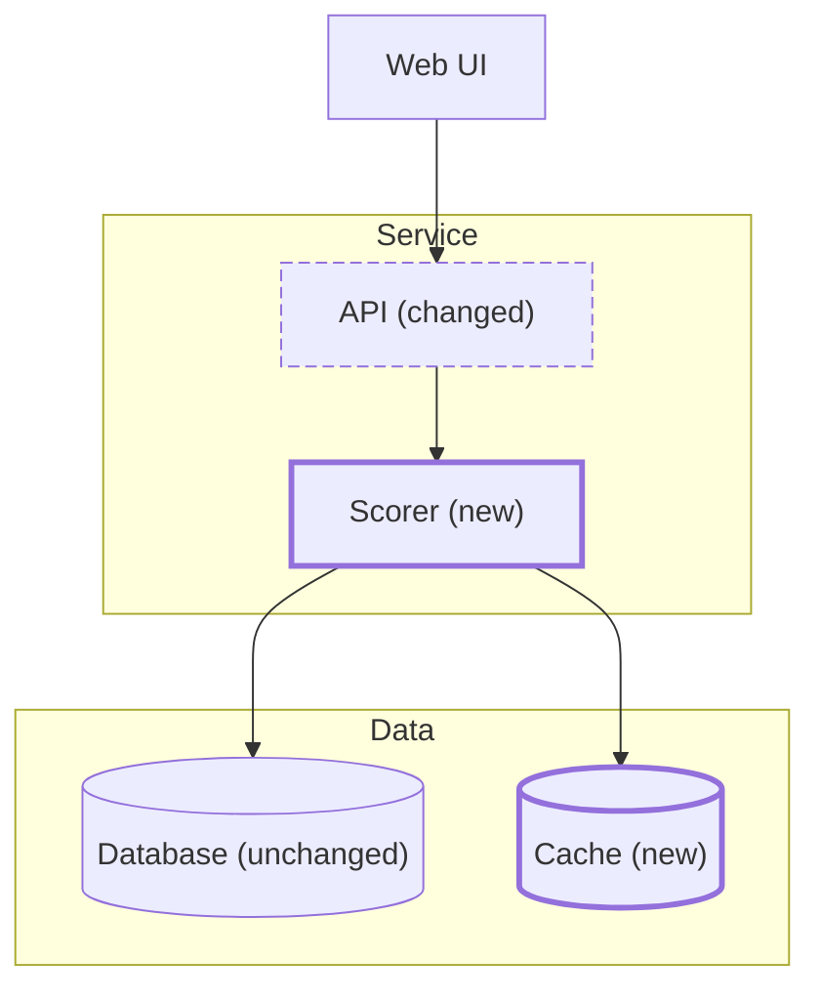

# Change maps

A change map shows the modules a plan adds or changes among the ones it leaves alone, and which way their dependencies point.

- Arrows point from a module to what it depends on: calls, reads, and writes. Draw each dependency the plan names, and only those.
- Box modules by layer, the way the system is built — interface, services, data — never by change status. Boxes of "added" and "changed" modules split the layers apart and send most edges across boxes.
- Mark each module's status in its label, `(new)`, `(changed)`, or `(unchanged)`, so the status reads in both schemes and without color. Two `classDef`s with outline styles (a thick stroke for new, a dashed one for changed) make the touched modules stand out.
