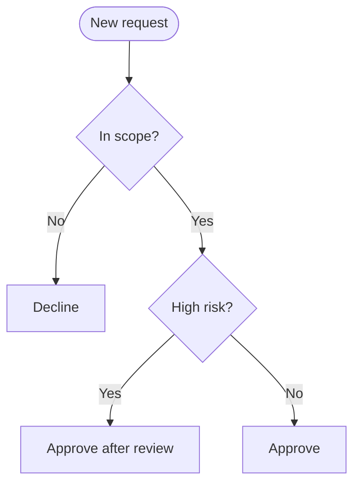
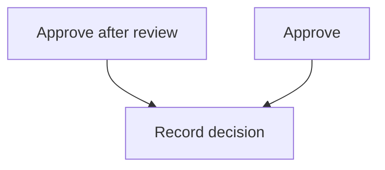

# Decision flows

A decision procedure — questions answered in a fixed order, each answer ending in an outcome or leading to the next question — is a `flowchart TB` chain: the questions in one column, top to bottom, each outcome beside the question that decides it.

- Each question is a diamond labeled with the question alone, `q_risk{"High risk?"}`: a diamond grows with its label, so a full sentence makes a huge shape; the exact criteria go in the caption.
- Label every answer edge (`Yes` / `No`, or the answer itself). Each outcome is its own box, one per answer. Tag outcomes with their role — `positive` for approve/allow, `negative` for reject/deny, `caution` for escalation, manual review, or retry — and leave the questions untagged.
- The answer that continues the procedure points straight at the next question, so the questions stay in one column.
- When several outcomes finish with the same step, keep that step out of the question diagram: edges merging back into one node break the question column into a staircase. Draw it in a second diagram: the step once, and only the outcomes that reach it (same ids), each pointing at it. A step only some outcomes take hangs off those outcomes alone.
- Start from one entry node naming what is being decided; no closing "Done" node.
- A decision flow is not boxed: containers would split the question column.
