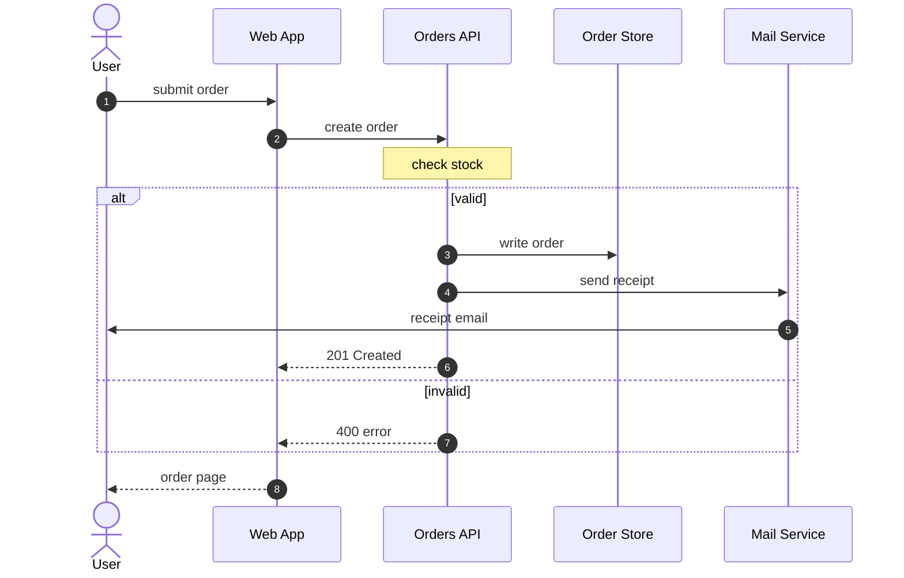
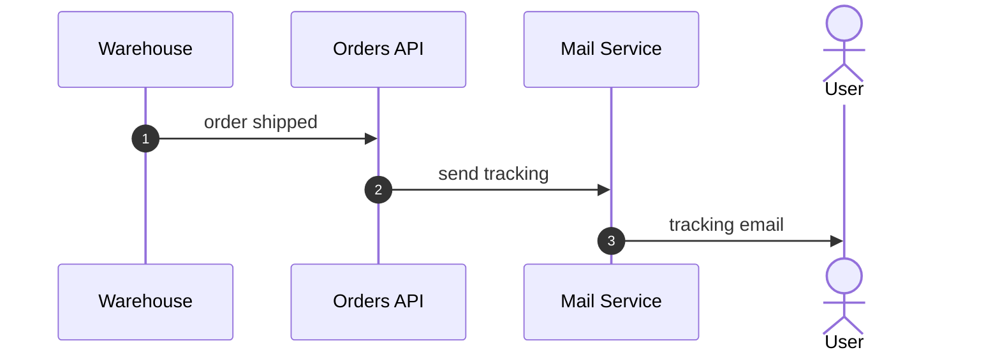

# Sequence diagrams

A request flow — messages passed between a few parties in a fixed order — is a `sequenceDiagram`: one lifeline per party, messages top to bottom in the order they happen, each numbered.

- Start with `autonumber`, so every message carries its step number.
- Every party the prose names is a participant, labeled with the name the prose uses (not an abbreviation). Declare them all before the first message, in the order they first act: `participant id as Label`, or `actor id as Label` for a person. A lifeline no message touches is empty clutter, so every participant, a person included, sends or receives at least one message.
- Every step where one party contacts another is a message, one line each: `from->>to: text` for a request, `from-->>to: text` for a reply. That includes lookups, notifications, and anything that reaches a person (an email, a redirect, a page): it is a message to that person's participant. Message text is a few words; the detail goes in the caption.
- Branches wrap the messages they cover: `alt condition` … `else condition` … `end`; an optional step is `opt condition` … `end`; a retry is `loop condition` … `end`. Conditions are a few words, and every block closes with its own `end`, the last one too: an unclosed block fails to render.
- Work a party does on its own is a `Note over id: text`, not a message to itself.

About a dozen messages and five participants fit the column. A longer flow continues in a second diagram from the point where it waits (for a person, a timer, another system), declaring only the participants it uses, with the same ids:

Participants anchor as `node:<id>` and messages as `edge:<from>-><to>`. The nth message from one participant to the same other one is `edge:<from>-><to>#n`; the first has no suffix.
- Participants cannot be tagged with roles: mermaid accepts no classes on sequence participants, so sequence diagrams stay neutral.
- The message exchange of a protocol or login flow is a sequence diagram even though sequences take no roles — never trade the right type for taggability. Components and their standing relationships stay a flowchart; only the messages over time belong here.
