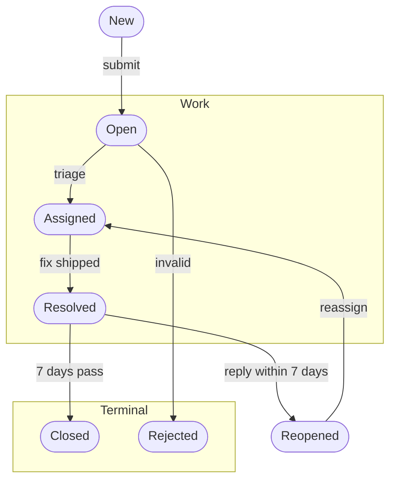

# State machines

A lifecycle — the states one thing moves through and the events that move it — is a `flowchart TB` (its nodes and edges are anchorable, unlike a `stateDiagram-v2`'s) with one stadium-shaped node `(["…"])` per state and one labeled edge per event:

- A state is somewhere the thing can rest until the next event, and each one gets its own node, including states reached only on a side path (`Reopened` above sits between the reply that starts it and the event that ends it). An event is an edge label, never a node.
- Box the main path's states by phase, in order, and put the terminal states together in a last box, so which states end the lifecycle reads at a glance. The entry state and a side-path state stand outside the boxes.
- Two events with the same source and target share one edge whose label names both.
- A review or approval checkpoint state can carry the `gate` role (`class Review gate`); terminal success states can carry `milestone`.
